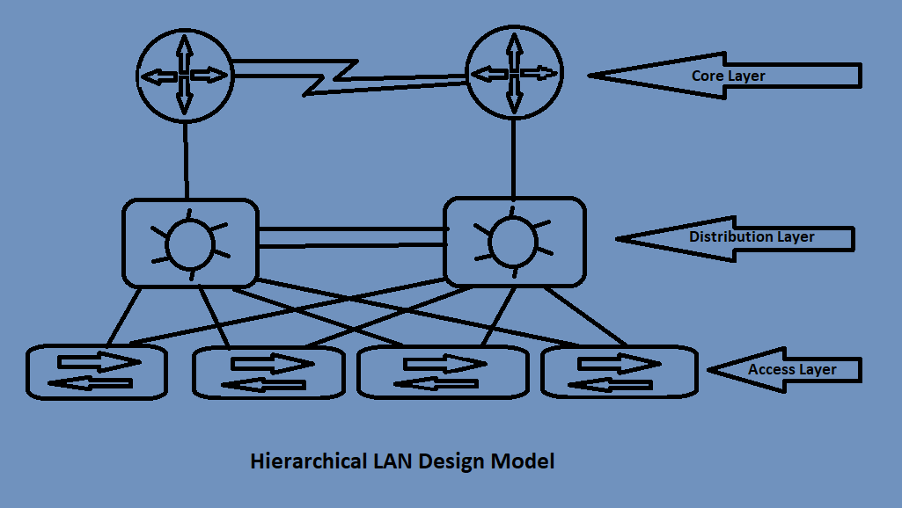

## 1.1.a Enterprise network design such as Tier 2, Tier 3, and Fabric Capacity planning
---------------------------------------------------------------------------------------------
You have been assigned as the new Network Infrastructure Lead for a new company that has just landed as a Fortune 500 company!  They ask you to lead a team that will help to implement a new network infrastructure and that you will have to make the big decisions on what type of equipment they will need and what you should buy for the company to get their company going.  Only problem is, there is a tight budget for the project and there is absolutely no way you can ask for more money without looking crazy, right?  I mean, you are helping them get connected with their 2 other remote branches.  So what do you do?

This objective will help you better understand what you would do in a situation like this.  Being able to look at a company's needs and tell them they need this type of network with those types of switches and routers is quite scary, unless you know the lingo!  But first, in order to persuade them to buy something that they think they don't need, you need to know about a network infrastructure in depth.

### Hierarchical Network Design
--------------------------------
The hierarchical network design has a topology where there are 3 layers:

1. Access Layer
1. Distribution Layer
1. Core Layer

**Access Layer** - also referred to as the **network edge**, this layer is where end-user devices or endpoints connect to the network infrastructure.  In this layer, you will see many devices that are either personal devices or wireless access points (WAPs).  
  * This layer provides high bandwidth device connections using wired and wireless acces technologies such as GigabitEthernet and 802.1n and 802.1ac wireless.
  * Types fo devices that you will see connected into this layer include PCs, IP phones, printers, WAPs, personal telepresence devices, and IP surveillance cameras.
  * The access layer can be segmented using VLANs to place devices into separate different **logical** networks which helps with performance, management, and security.
  * This layer also helps end-devices to connect knowing that there is a layer of protection from malicious attacks.  Although malicious attacks can still be an issue, this layer helps to decrease the risk.
    * Authentication at this layer through the means of RADIUS or TACACS+ can help with authenticating the correct users and keep threat vectors from getting into resources that they should not be in.
    * The QoS trust boundary and mechanisms are enabled here to ensure that QoS is provided end-to-end to satisfy the end-users' quality of experience (QoE).

**Distribution Layer** - this layer's primary function is to aggregate the access layer switches in a given building or campus.  When a bunch of switches become meshed together with more and more connections between each other, a distribution layer should be implemented to decrease the number of connections that the switches have to make.
  * This layer provides a boundary between the Layer 2 access layer domain and the Layer 3 core layer domain.  Think of the distribution layer as a middle man between the access and core layers.  When the access layer communicates up the chain, it answers to the distribution layer, and from there the distribution layer send the information that it received from the access layer and sends it up to the core layer.

There are 2 key functions of this boundary:
  * On the Layer 2 side, it creates a boundary for STP (Spanning Tree Protocol) which limits the propogation of layer 2 faults.
  * On the Layer 3 side, it provides a logical point to summarize IP routing tables for easier troubleshooting and reduces protocol overhead for faster recovery from failures.

Distribution switches need to be deployed in **pairs** for redundancy, as pictured below.

**Core Layer** - This layer is considered the backbone and aggregation point for multiple networks and provides:
  * Scalibility
  * High Availabilty
  * Fast convergence for the network
  * The core layer can provide high-speed connectivity for larger enterprises with multiple campus networks.
  * This layer can provide interconnectivity between the end-user access layer and other network blocks such as:
    * Data Center
    * Private Cloud
    * Public Cloud
    * Internet edge
    * WAN
    * Network services

A **network block** is simply a logical block that represents a certain service or technology.  It groups together a network as to make the logical topology easier to read.  Taking the devices connected together and making one single block, the logical topology can look smoother and easier to manage.  Each network block contains it's own access, distribution and core layers, they are condensed into one single block or place in the network (PIN).

Pictured below is an example of a hierarchical Tier 3 design that has 4 access switches in the access layer all interconnected with 2 distribution switches and those 2 switches are connected together and then connected up to 2 core layer routers.  This design is perfect for a large enterprise network that has multiple branches or offices that need that single core layer.  The reason why it is called a **3 Tier design** is because each of the layers are in it's separate domain.  The access layer, distribution layer, and the core layer all are separate parts of the network that have their own functions.  3 domains, 3 tiers.

*Figure 1: Example of the Tier 3 Hierarchical LAN Design Model*

But what happens when the company isn't that large?  What if the office is just one building and they don't necessarily NEED this type of topology?  Well, let's move to the next topic and find out!

### Collapsed Core (Two-Tier design)
--------------------------------------
When you don't need separate network blocks for your network and your needs are less than that of an organization, the **2 Tier design** can accomplish the needs for your smaller business.  A design model for this would **collapse** 2 cores, hence the **collapsed core**.  By combining 2 tiers together, you can have a smaller network to work with if necessary.  You can collapse the Core layer and Distribution layers and leave the Access layer alone, or you can leave the Core layer alone and combine the Distibution and Access layers.  It all depends on the equipment that is being used.  If you have routers that can be used for the core layer, and some distribution switches, you can use the Core Dist/Acc model when the routers are connected to that switch and the end devices connected to the distribution switch.  Depending on the needs and equipment will depend on what type of model you can use.

<u><strong>Note that you cannot combine the Core layer with the Access layer.  The Three Tier Model should still be referenced and the Distribution layer is in the middle of the Core and Access</strong></u>

If you took Figure 1 for example, you could see that the switches being used connect between the routers and clients.  If by chance those switches were MultiLayer switches, you could just use the switches as the core and distribution layer and take the routers out of the equation.  It really depends on the needs of your company/client and the design that is desired for the company.

There are other models including:

 * Layer 2 Access Layer (STP Based)
 * Layer 3 Access Layer (Routed Access)

The **Layer 2 Access Layer** consists of using Layer 2 connections from the Access layer to the Distibution layer or collapsed C/D layer.  Using VLANs with trunking, the network would rely on STP to make sure that connections are not looped and that the network doesn't buckle down and crash under a broadcast storm due to redundant links between switches.  Using STP, links can be shut down by STP to help flow of traffic easier to manage.  But remember, when this happens, the shut down link does not forward traffic, it is in a "standby" or listening state to watch when the traffic needs to be sent through due to a outage over on the other switch.  To make sure that one link isn't fully down, you can configure PVST+ or MST to have certain VLANs go through one path while other VLANs take the other path.  The one problem with this is still the inefficiency in the links.  There will never be a full connection on each link, as meaning there will be a VLAN that will be in a listening state on a link.  If it isn't a factor though, the cost for this model is less than its competitor.

The **Layer 3 Access Layer** consists of Layer 3 links from Access layer through to the Distribution and Core layers.  No need for STP now because instead of trunking VLANs between switches, the packets are now being routed from the clients to the routers, making it easier to switch traffic throughtout the network.  One downside to this is cost.  Spending more money on a L3 switch can be a high budget.  Another downside is this design does not support spanning VLANs across multiple access switches.  Also, the strain on routers can take its toll.  Probably not as much, but when you look at how a router switches packets, it uses the routing table, and with that many packets coming through, it can take a toll on the router's CPU.

A few more advantages of the L3 Access Layer are:

 * No first-hop redundancy protocols are needed
 * Easier troubleshooting (using ping or traceroute)
 * Faster convergence (EIGRP and OSPF converge faster than STP

### Conclusion
----------------------
When designing the architecture of the network and building the network out, it is key to understand what is needed and planning out everything before implementing is most important.  As a professional, you will come across these topics when someone comes to you and says "We need your help designing our network!"

[CCNP Notes](https://rcestep.github.io/CCNP-Notes) / [1.0 Architecture](..) / [1.1 Explain the different design principles used in an enterprise network](README.md) / **1.1.a Enterprise network design such as Tier 2, Tier 3, and Fabric Capacity planning**
